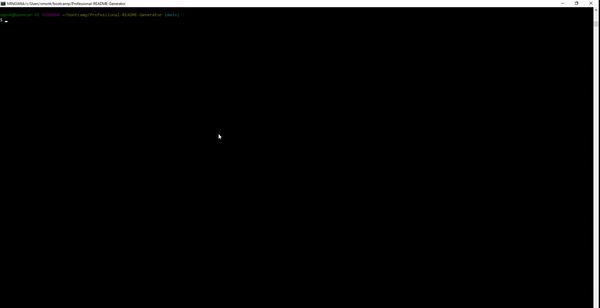

# Professional-README-Generator

## Description

This project generates a ReadMe.md file based on your answers to the prompts. This project was built to be a quick and easy way to create a ReadMe file for any given project. I learned a lot about using javascript in a command line interface, specifically learning how to prompt the user and how to use the input.

## Installation

To use this ReadMe generator you will need to git clone the repo to your local machine. 

Run npm install inquirer to install the needed package dependencies.

Run the application by typing node index.js in the command line.

## Usage

Answer the prompt questions to the end and your README file will be generated.

## Credits

Starter code from University of Washington

[Inquirer package](https://www.npmjs.com/package/inquirer/v/8.2.4)

## License

MIT License

Copyright (c) 2022 Syre11

Permission is hereby granted, free of charge, to any person obtaining a copy
of this software and associated documentation files (the "Software"), to deal
in the Software without restriction, including without limitation the rights
to use, copy, modify, merge, publish, distribute, sublicense, and/or sell
copies of the Software, and to permit persons to whom the Software is
furnished to do so, subject to the following conditions:

The above copyright notice and this permission notice shall be included in all
copies or substantial portions of the Software.

THE SOFTWARE IS PROVIDED "AS IS", WITHOUT WARRANTY OF ANY KIND, EXPRESS OR
IMPLIED, INCLUDING BUT NOT LIMITED TO THE WARRANTIES OF MERCHANTABILITY,
FITNESS FOR A PARTICULAR PURPOSE AND NONINFRINGEMENT. IN NO EVENT SHALL THE
AUTHORS OR COPYRIGHT HOLDERS BE LIABLE FOR ANY CLAIM, DAMAGES OR OTHER
LIABILITY, WHETHER IN AN ACTION OF CONTRACT, TORT OR OTHERWISE, ARISING FROM,
OUT OF OR IN CONNECTION WITH THE SOFTWARE OR THE USE OR OTHER DEALINGS IN THE
SOFTWARE.

## How to Contribute

If you have any comments or notice any issues feel free to create an issue explaining the issue in the GitHub repository at <https://github.com/Syre11/Professional-README-Generator>

## Tests

Ran a test for each individual license choice to make sure everything generates properly.